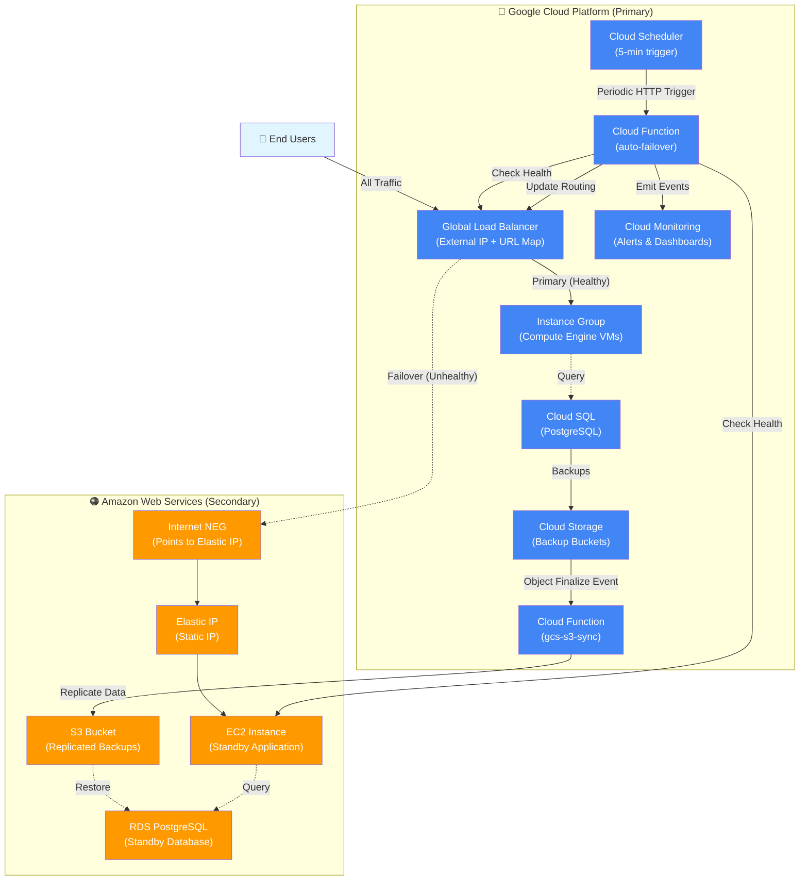

# Multi-Cloud Disaster Recovery System Architecture

## Overview

The multicloud-dr-system is an automated multi-cloud disaster recovery system implementing an active-passive failover pattern between Google Cloud Platform (primary) and AWS (secondary). The system features intelligent health monitoring with automated failover orchestration via Cloud Functions that dynamically routes traffic through a GCP Global Load Balancer

All traffic flows through a single GCP Global Load Balancer IP, eliminating DNS-based routing complexity and enabling fast failover without DNS propagation delays. The URL Map determines whether traffic is routed to the GCP Instance Group (primary) or the Internet NEG pointing to AWS Elastic IP (secondary)

---

## Architecture Diagram

---

## Design Patterns

### Active-Passive Failover Pattern

The system implements an active-passive disaster recovery architecture where GCP serves as the primary active environment and AWS serves as the passive secondary environment. Traffic is routed to the active backend, with automated failover to the passive backend when the primary becomes unhealthy.

### URL Map-Based Dynamic Routing

The URL Map's default_service field is dynamically updated to switch between GCP and AWS backends without changing the external IP address or requiring DNS updates. This enables failover in seconds rather than minutes.

### Event-Driven Health Monitoring

Cloud Scheduler triggers the auto-failover function every 5 minutes via HTTP to monitor backend health and orchestrate failover. The function uses a hysteresis mechanism requiring 3 consecutive failures before failover and 3 consecutive recoveries before failback to prevent flapping.

---

## Components

### GCP Components (Primary)

#### Global Load Balancer

* **Global Static IP**: Single external IP address as the entry point for all traffic
* **URL Map**: Routes traffic to healthy backend service
* **HTTP/HTTPS Forwarding Rules**: Port 80 redirects to HTTPS, port 443 with managed SSL certificate
* **Backend Services**: GCP primary (Instance Group) and AWS secondary (Internet NEG)

#### Instance Group

* **Unmanaged Instance Group**: Contains primary VM instances running the application
* **Compute Engine VMs**: f1-micro instances running Debian 11, no external IP (uses Cloud NAT)
* **Named Port**: HTTP on port 80 for backend service connectivity

#### Cloud Functions

* **auto-failover**: Python 3.11 function that monitors health endpoints and updates URL map routing
  * Checks GCP and AWS health endpoints (HTTP 200 + JSON {"status": "healthy"})
  * 5-second HTTP request timeout
  * Updates URL Map default_service field during failover
  * Verification and rollback logic to ensure successful failover
* **gcs-s3-sync**: Event-driven function for cross-cloud data replication
  * Triggered by GCS object finalize events
  * Downloads from GCS and uploads to S3
  * Retrieves AWS credentials from Secret Manager

#### Cloud Scheduler

* **Periodic Trigger**: Invokes auto-failover function every 5 minutes via HTTP POST

#### Cloud SQL

* **PostgreSQL Database**: Primary database with automated backups to Cloud Storage

#### Cloud Storage

* **Backup Buckets**: Stores Cloud SQL backups and application data, synced to S3 via gcs-s3-sync function

#### Cloud Monitoring

* **Failover Alerts**: Triggered when switching to AWS
* **Failback Alerts**: Triggered when recovering to GCP
* **Critical Alerts**: Triggered when both backends are unhealthy

### AWS Components (Secondary)

#### Internet NEG

* **Internet Network Endpoint Group**: Points to AWS Elastic IP via FQDN
  * Type: INTERNET_FQDN_PORT
  * Default port: 80
  * Enables cross-cloud routing from GCP Load Balancer to AWS

#### EC2 Instance

* **Standby Application Server**: t3.micro instance running Ubuntu 20.04 LTS
* **User Data Script**: Configures DB connection and S3 access

#### Elastic IP

* **Static IP Address**: Provides stable endpoint for Internet NEG
* **EIP Association**: Links Elastic IP to EC2 instance

#### RDS PostgreSQL

* **Standby Database**: Available for restore from Cloud SQL backups

#### S3 Bucket

* **Replicated Backups**: Receives data synced from GCS

---

## Data Flow

### User Traffic Flow

1. **User Request** → GCP Global Load Balancer External IP
2. **Load Balancer** → URL Map evaluates routing rules
3. **Primary Path** → GCP Instance Group backend service → Compute Engine VMs
4. **Failover Path** → AWS secondary backend service → AWS Elastic IP → EC2 Instance

### Health Check Flow
1. **Cloud Scheduler triggers auto-failover function every 5 minutes**
2. **Function checks GCP health endpoint**: http://{LOAD_BALANCER_IP}/health
3. **Function checks AWS health endpoint**: http://{AWS_ELASTIC_IP}/health
4. **Health Validation**: Both endpoints must return HTTP 200 with JSON response {"status": "healthy"} within 5 seconds
5. **Failover Decision**:
   - If GCP primary unhealthy for 3 consecutive checks AND AWS secondary healthy → update URL Map to AWS
   - If AWS active and GCP recovers for 3 consecutive checks → failback to GCP
   - If both backends unhealthy → emit critical alert, maintain current routing
6. **URL Map Update**: Function updates the default_service field to point to new backend
7. **Verification**: Function verifies URL Map updated correctly (5s propagation wait)
8. **Monitoring Alerts**: Cloud Monitoring emits structured events and alerts operators

## Data Replication Flow
1. **Cloud SQL Backups** → Cloud Storage backup buckets
2. **GCS Object Finalize Event** → Triggers gcs-s3-sync function
3. **Function downloads from GCS** → Uploads to S3 with metadata
4. **S3 Bucket** contains replicated backups available for disaster scenarios
5. **RDS available for restore** from S3-replicated Cloud SQL backups

## Key Architectural Decisions
# Single Global Entry Point
All traffic flows through one GCP Global Load Balancer IP, providing a consistent entry point regardless of which backend is active. This simplifies client configuration and eliminates the need for DNS-based failover, which typically requires 60+ seconds for propagation.

# URL Map-Based Routing for Fast Failover
The URL Map's default_service field is dynamically updated to switch backends, enabling failover without DNS changes. The URL Map update operation completes within 60 seconds, with 5 seconds for propagation.

# Internet NEG for Cross-Cloud Routing
The Internet Network Endpoint Group enables the GCP Load Balancer to route traffic to AWS infrastructure using FQDN-based endpoints. This provides seamless failover to AWS via Elastic IP without requiring VPN or interconnect between clouds.

# Event-Driven Scheduling for Reliable Health Checks
Cloud Scheduler provides reliable, distributed triggering of the auto-failover function, ensuring health monitoring continues even if the primary infrastructure fails. The 5-minute check interval with 3 consecutive failure requirement provides an RTO (Recovery Time Objective) of approximately 15 minutes.

# Hysteresis-Based State Machine
The auto-failover function implements a hysteresis mechanism requiring 3 consecutive failures before failover and 3 consecutive recoveries before failback. This prevents premature failover from transient network issues or brief service disruptions.

# Verification and Rollback
The auto-failover function includes verification logic that checks the URL Map was updated correctly after failover, with automatic rollback to the previous backend if verification fails. This ensures failover operations complete successfully before persisting state changes.