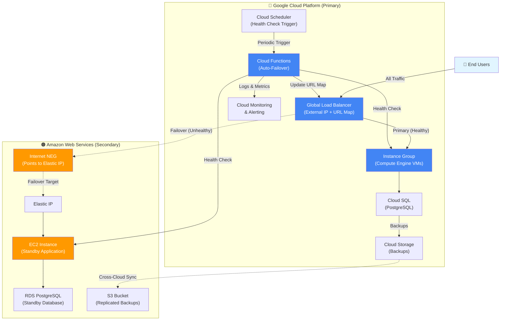

# Multi-Cloud Disaster Recovery System


An automated [multi-cloud disaster recovery system](https://app.dosu.dev/documents/e1513f8c-eb9e-4b78-b1b7-1a7b6a695fa0) implementing an active-passive failover pattern between Google Cloud Platform (primary) and AWS (secondary). The system features intelligent health monitoring with [automated failover orchestration via Cloud Functions](https://app.dosu.dev/documents/e1513f8c-eb9e-4b78-b1b7-1a7b6a695fa0) that dynamically routes traffic through a [GCP Global Load Balancer](https://app.dosu.dev/documents/e1513f8c-eb9e-4b78-b1b7-1a7b6a695fa0), ensuring high availability across cloud providers. Built entirely with Infrastructure as Code using Terraform to demonstrate enterprise-grade disaster recovery architecture.

---

## 🏗️ Architecture

The system uses a [GCP Global Load Balancer with URL Map routing to either the GCP Instance Group (primary) or an Internet NEG pointing to AWS Elastic IP (secondary)](https://app.dosu.dev/documents/e1513f8c-eb9e-4b78-b1b7-1a7b6a695fa0):


---

## ✨ Key Features

* **Intelligent Automated Failover**: [Cloud Function monitors both backends and updates GCP URL map in real-time](https://app.dosu.dev/documents/e1513f8c-eb9e-4b78-b1b7-1a7b6a695fa0) when primary becomes unhealthy
* **Single Entry Point**: [All traffic flows through one GCP Global Load Balancer IP](https://app.dosu.dev/documents/e1513f8c-eb9e-4b78-b1b7-1a7b6a695fa0), routing dynamically to healthy backend
* **Cross-Cloud Routing**: [Internet NEG enables seamless failover to AWS infrastructure via Elastic IP](https://app.dosu.dev/documents/e1513f8c-eb9e-4b78-b1b7-1a7b6a695fa0)
* **Comprehensive IaC**: [19 modular Terraform files](https://github.com/Bham06/multicloud-dr-system/blob/984f880d2fb6a977a254cf49cd1e704f56620e35/terraform) managing networking, compute, databases, and serverless components
* **Data Replication Pipeline**: [Automated GCS-to-S3 sync via Cloud Functions](https://app.dosu.dev/documents/e1513f8c-eb9e-4b78-b1b7-1a7b6a695fa0) ensures backup availability across clouds
* **Database Disaster Recovery**: [Cloud SQL and RDS with backup/restore automation](https://app.dosu.dev/documents/e1513f8c-eb9e-4b78-b1b7-1a7b6a695fa0)
* **Event-Driven Monitoring**: [Cloud Monitoring with alerting on failover events](https://app.dosu.dev/documents/e1513f8c-eb9e-4b78-b1b7-1a7b6a695fa0)

---

## 🛠️ Tech Stack

### Google Cloud Platform

* **Compute**: [Compute Engine (VMs, Instance Groups), Cloud Functions (Python 3.11)](https://app.dosu.dev/documents/e1513f8c-eb9e-4b78-b1b7-1a7b6a695fa0)
* **Networking**: [Global Load Balancer, VPC, Internet NEG](https://app.dosu.dev/documents/e1513f8c-eb9e-4b78-b1b7-1a7b6a695fa0)
* **Data**: [Cloud SQL (PostgreSQL), Cloud Storage (GCS)](https://app.dosu.dev/documents/e1513f8c-eb9e-4b78-b1b7-1a7b6a695fa0)
* **Operations**: [Cloud Scheduler, Secret Manager, Cloud Monitoring](https://app.dosu.dev/documents/e1513f8c-eb9e-4b78-b1b7-1a7b6a695fa0)

### Amazon Web Services

* **Compute**: [EC2, Elastic IP](https://app.dosu.dev/documents/e1513f8c-eb9e-4b78-b1b7-1a7b6a695fa0)
* **Data**: [RDS (PostgreSQL), S3](https://app.dosu.dev/documents/e1513f8c-eb9e-4b78-b1b7-1a7b6a695fa0)

### Infrastructure & Automation

* **IaC**: Terraform for declarative infrastructure provisioning
* **Languages**: [Python 3.11](https://app.dosu.dev/documents/e1513f8c-eb9e-4b78-b1b7-1a7b6a695fa0) (Cloud Functions), Bash (automation scripts)

---

## 📁 Project Structure

```
multicloud-dr-system/
├── terraform/
│   ├── gcp/                          # GCP infrastructure (primary)
│   │   ├── functions/
│   │   │   ├── auto-failover/        # Health monitoring & URL map updates
│   │   │   └── gcs-s3-sync/          # Cross-cloud data replication
│   │   ├── network.tf                # VPC, subnets, firewall rules
│   │   ├── compute.tf                # VM instances, instance groups
│   │   ├── loadbalancer.tf           # Global LB, backend services, URL map
│   │   ├── database.tf               # Cloud SQL (PostgreSQL)
│   │   ├── storage.tf                # GCS buckets for backups
│   │   ├── data.tf                   # Secret Manager, function packaging
│   │   ├── monitoring.tf             # Monitoring, alerting, dashboards
│   │   └── ...                       # Additional configuration files
│   │
│   └── aws/                          # AWS infrastructure (secondary)
│       ├── network.tf                # VPC, subnets, security groups
│       ├── compute.tf                # EC2 instances, Elastic IP
│       ├── database.tf               # RDS (PostgreSQL)
│       ├── storage.tf                # S3 buckets for replicated data
│       └── ...                       # Additional configuration files
│
└── scripts/                          # Deployment automation utilities
    ├── deployment-gcp.sh
    ├── deployment-aws.sh
    └── restore-db.sh
```
*Source: [Repository structure](https://github.com/Bham06/multicloud-dr-system/blob/984f880d2fb6a977a254cf49cd1e704f56620e35/)*

---

## ⚙️ How It Works

### Automated Failover Workflow

1. **Health Monitoring**: [Cloud Scheduler triggers the auto-failover function periodically via HTTP](https://app.dosu.dev/documents/e1513f8c-eb9e-4b78-b1b7-1a7b6a695fa0)

2. **Health Assessment**: [Function checks both GCP and AWS health endpoints (expecting HTTP 200 + JSON {"status": "healthy"})](https://app.dosu.dev/documents/e1513f8c-eb9e-4b78-b1b7-1a7b6a695fa0) with 5-second timeout

3. **Failover Decision**: [If the active backend is unhealthy and the secondary is healthy, the function updates the GCP URL map](https://app.dosu.dev/documents/e1513f8c-eb9e-4b78-b1b7-1a7b6a695fa0) to redirect traffic

4. **Traffic Routing**: [All user traffic flows through the single Global Load Balancer IP to whichever backend is currently active](https://app.dosu.dev/documents/e1513f8c-eb9e-4b78-b1b7-1a7b6a695fa0)

5. **Alerting**: [Cloud Monitoring emits structured events and alerts operators on failover actions](https://app.dosu.dev/documents/e1513f8c-eb9e-4b78-b1b7-1a7b6a695fa0)

### Data Synchronization

* **Cross-Cloud Replication**: [GCS-to-S3 sync function ensures backup data is available in AWS](https://app.dosu.dev/documents/e1513f8c-eb9e-4b78-b1b7-1a7b6a695fa0) for disaster scenarios

* **Database Recovery**: [Cloud SQL backups can be restored to AWS RDS](https://app.dosu.dev/documents/e1513f8c-eb9e-4b78-b1b7-1a7b6a695fa0), enabling full application failover

---

## 📸 Screenshots / Outputs

*This section can showcase:*

* Terraform apply output with created resources
* GCP Load Balancer configuration showing backend services
* Cloud Function logs demonstrating successful failover
* Cloud Monitoring dashboard with health metrics

---

## 🚀 Future Improvements

While this project demonstrates core DR capabilities, several enhancements would make it production-ready:

**Architectural Enhancements:**

* **Advanced Health Checks**: [Implement latency thresholds, error rate monitoring, and exponential backoff](https://app.dosu.dev/documents/e1513f8c-eb9e-4b78-b1b7-1a7b6a695fa0) to handle transient failures gracefully
* **Bidirectional Failback**: Add automated failback to primary with configurable cooldown periods
* **Multi-Region AWS**: Expand secondary to multiple AWS regions for geographic redundancy

**Engineering Best Practices:**

* **Automated Testing**: [Implement unit tests for failover logic with mocked GCP APIs](https://app.dosu.dev/documents/e1513f8c-eb9e-4b78-b1b7-1a7b6a695fa0)
* **Chaos Engineering**: Integrate fault injection tools (e.g., Chaos Monkey) for resilience testing
* **Observability**: Add distributed tracing (OpenTelemetry) and custom metrics for deeper insights

---

## 👨‍💻 Built By

**Humble**

Portfolio Project demonstrating expertise in multi-cloud architecture, Infrastructure as Code, and automated disaster recovery systems.

* 🐙 GitHub: [@Bham06](https://github.com/Bham06)

---

*This is a portfolio project designed to showcase technical skills in cloud architecture, automation, and infrastructure engineering. It is not intended for production deployment or external contributions.*