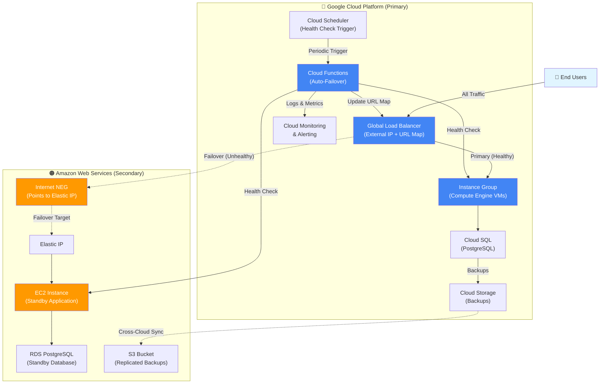

# Multi-Cloud Disaster Recovery System


An automated multi-cloud disaster recovery system implementing an active-passive failover pattern between Google Cloud Platform (primary) and AWS (secondary). The system features intelligent health monitoring with automated failover orchestration via Cloud Functions that dynamically routes traffic through a GCP Global Load Balancer, ensuring high availability across cloud providers. Built entirely with Infrastructure as Code using Terraform to demonstrate enterprise-grade disaster recovery architecture.

---

## 🏗️ Architecture

The system uses a GCP Global Load Balancer with URL Map routing to either the GCP Instance Group (primary) or an Internet NEG pointing to AWS Elastic IP (secondary):


---

## ✨ Key Features

* **Intelligent Automated Failover**: Cloud Function monitors both backends and updates GCP URL map in real-time when primary becomes unhealthy
* **Single Entry Point**: All traffic flows through one GCP Global Load Balancer IP, routing dynamically to healthy backend
* **Cross-Cloud Routing**: Internet NEG enables seamless failover to AWS infrastructure via Elastic IP
* **Comprehensive IaC**: 19 modular Terraform files managing networking, compute, databases, and serverless components
* **Data Replication Pipeline**: Automated GCS-to-S3 sync via Cloud Functions ensures backup availability across clouds
* **Database Disaster Recovery**: Cloud SQL and RDS with backup/restore automation
* **Event-Driven Monitoring**: Cloud Monitoring with alerting on failover events

---

## 🛠️ Tech Stack

### Google Cloud Platform

* **Compute**: Compute Engine (VMs, Instance Groups), Cloud Functions (Python 3.11)
* **Networking**: Global Load Balancer, VPC, Internet NEG
* **Data**: Cloud SQL (PostgreSQL), Cloud Storage (GCS)
* **Operations**: Cloud Scheduler, Secret Manager, Cloud Monitoring

### Amazon Web Services

* **Compute**: EC2, Elastic IP
* **Data**: RDS (PostgreSQL), S3

### Infrastructure & Automation

* **IaC**: Terraform for declarative infrastructure provisioning
* **Languages**: Python 3.11 (Cloud Functions), Bash (automation scripts)

---

## 📁 Project Structure

```
multicloud-dr-system/
├── terraform/
│   ├── gcp/                          # GCP infrastructure (primary)
│   │   ├── functions/
│   │   │   ├── auto-failover/        # Health monitoring & URL map updates
│   │   │   └── gcs-s3-sync/          # Cross-cloud data replication
│   │   ├── network.tf                # VPC, subnets, firewall rules
│   │   ├── compute.tf                # VM instances, instance groups
│   │   ├── loadbalancer.tf           # Global LB, backend services, URL map
│   │   ├── database.tf               # Cloud SQL (PostgreSQL)
│   │   ├── storage.tf                # GCS buckets for backups
│   │   ├── data.tf                   # Secret Manager, function packaging
│   │   ├── monitoring.tf             # Monitoring, alerting, dashboards
│   │   └── ...                       # Additional configuration files
│   │
│   └── aws/                          # AWS infrastructure (secondary)
│       ├── network.tf                # VPC, subnets, security groups
│       ├── compute.tf                # EC2 instances, Elastic IP
│       ├── database.tf               # RDS (PostgreSQL)
│       ├── storage.tf                # S3 buckets for replicated data
│       └── ...                       # Additional configuration files
│
└── scripts/                          
    ├── automated-failover-test.sh
    ├── chaos-tests.sh
    ├── dr-test.sh
    ├── inegration-test.sh
    ├── monitor-replication.sh
    └── restore-db.sh
```

---

## ⚙️ How It Works

### Automated Failover Workflow

1. **Health Monitoring**: Cloud Scheduler triggers the auto-failover function periodically via HTTP

2. **Health Assessment**: Function checks both GCP and AWS health endpoints (expecting HTTP 200 + JSON {"status": "healthy"}) with 5-second timeout

3. **Failover Decision**: If the active backend is unhealthy and the secondary is healthy, the function updates the GCP URL map to redirect traffic

4. **Traffic Routing**: All user traffic flows through the single Global Load Balancer IP to whichever backend is currently active

5. **Alerting**: Cloud Monitoring emits structured events and alerts operators on failover actions

### Data Synchronization

* **Cross-Cloud Replication**: GCS-to-S3 sync function ensures backup data is available in AWS for disaster scenarios

* **Database Recovery**: Cloud SQL backups can be restored to AWS RDS, enabling full application failover

---


---

## 🚀 Future Improvements

While this project demonstrates core DR capabilities, several enhancements would make it production-ready:

**Architectural Enhancements:**

* **Advanced Health Checks**: Implement latency thresholds, error rate monitoring, and exponential backoff to handle transient failures gracefully
* **Bidirectional Failback**: Add automated failback to primary with configurable cooldown periods
* **Multi-Region AWS**: Expand secondary to multiple AWS regions for geographic redundancy

**Engineering Best Practices:**

* **Automated Testing**: Implement unit tests for failover logic with mocked GCP APIs
* **Chaos Engineering**: Integrate fault injection tools (e.g., Chaos Monkey) for resilience testing
* **Observability**: Add distributed tracing (OpenTelemetry) and custom metrics for deeper insights

---

## 👨‍💻 Built By

**Humble**

Final Year Project demonstrating expertise in multi-cloud architecture, Infrastructure as Code, and automated disaster recovery systems.

* 🐙 GitHub: [@Bham06](https://git.cs.bham.ac.uk/projects-2025-26/heu319)

---

